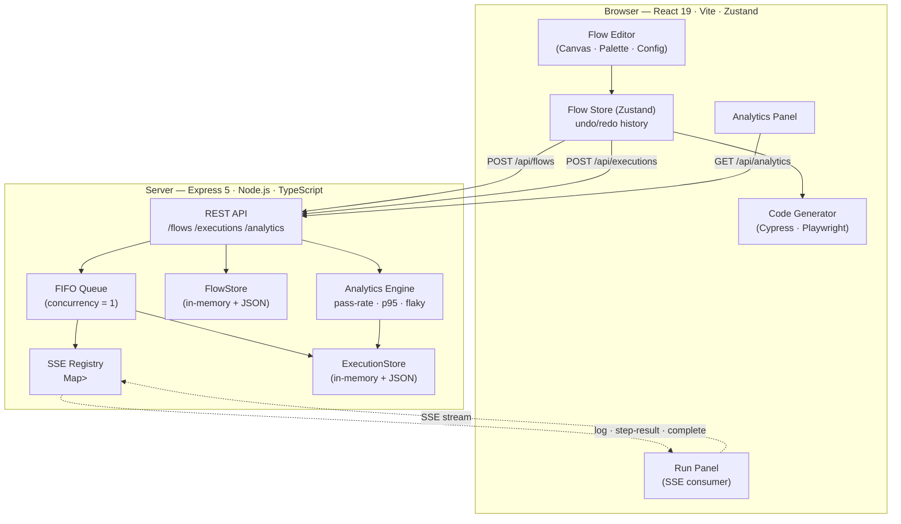
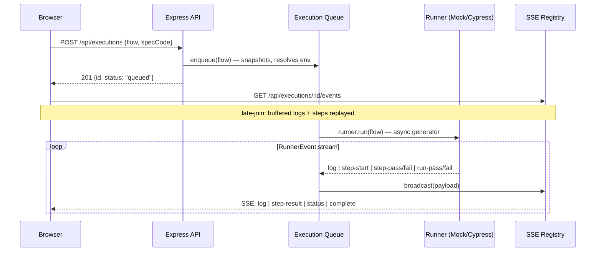
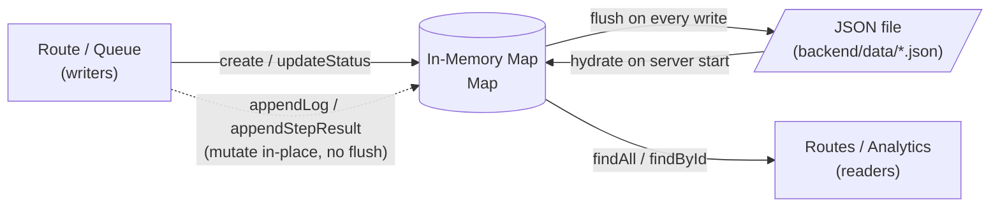
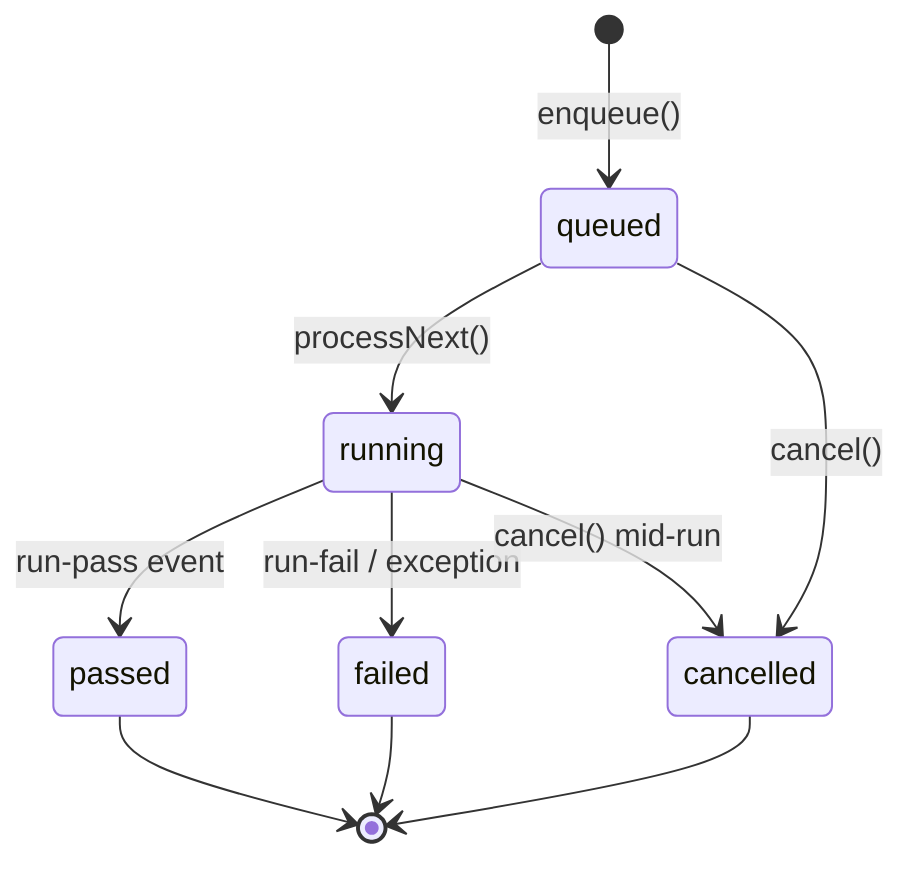
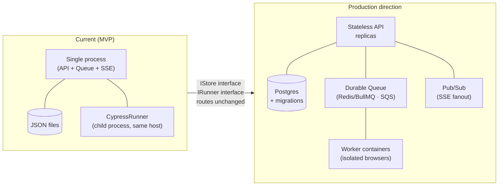

# Architecture

## High-Level Overview

Visual Test Builder is a full-stack E2E test authoring and execution system. The frontend owns the test authoring domain: schema, validation, command registry, and code generation. The backend owns saved flows, execution orchestration, live event streaming, and analytics.

## Module Responsibilities

| Module | Path | Responsibility |
| --- | --- | --- |
| App shell | `frontend/src/app` | Main editor layout and top-level panel composition |
| UI features | `frontend/src/features` | Canvas, palette, config, code, run, history, analytics panels |
| Flow model | `frontend/src/core/model` | Zod schemas, factories, migration support |
| State | `frontend/src/core/state` | Zustand flow store, selection, undo/redo, mutation actions |
| Registry | `frontend/src/core/registry` | Command definitions, defaults, chain compatibility, validation hooks |
| Codegen | `frontend/src/core/codegen` | Cypress and Playwright emitters |
| Adapters | `frontend/src/core/adapters` | Framework-specific selector translations |
| API clients | `frontend/src/services` | Flow, execution, analytics HTTP clients |
| API routes | `backend/src/routes` | Express route layer |
| Stores | `backend/src/db` | JSON-backed flow and execution repositories |
| Queue | `backend/src/queue` | FIFO execution queue, SSE subscriber registry |
| Runners | `backend/src/runner` | IRunner interface, MockRunner, CypressRunner |
| Analytics | `backend/src/analytics` | Pass-rate, duration, flaky-step calculations |

## Request Lifecycle

| Step | Component | Detail |
| --- | --- | --- |
| 1 | `ExecutionPanel` | User clicks `Run Test` |
| 2 | `executionApi.run()` | Generates `specCode` from current flow |
| 3 | Express route | `POST /api/executions` validates a loose v2 payload via Zod |
| 4 | Queue | `enqueue()` snapshots flow, resolves active environment, creates execution record |
| 5 | Runner | Mock or Cypress runner emits normalized `RunnerEvent` stream |
| 6 | Store | Execution status, logs, step results updated in memory |
| 7 | SSE | Browser receives live status/log/step-result/complete payloads |

## Data Flow

| Data | Producer | Consumer | Notes |
| --- | --- | --- | --- |
| `Flow` | Frontend editor | Validation, codegen, save/run APIs | Versioned `2.0` tree |
| `specCode` | Frontend codegen | Backend Cypress runner | Generated client-side today; see [DECISIONS.md](DECISIONS.md) |
| `Execution` | Backend queue | History, analytics, SSE | Contains flow snapshot, logs, step results |
| `FlakyStat` | Analytics engine | Analytics panel | Sliding window over recent execution history |

## DB Interaction Flow

| Operation | Store | Current behavior | Production concern |
| --- | --- | --- | --- |
| Save flow | `FlowStore` | In-memory map then JSON flush | No transactions or write-conflict handling |
| Update flow | `FlowStore` | Replace by ID, preserve timestamps | No optimistic concurrency |
| Create execution | `ExecutionStore` | Persist queued execution immediately | Large history grows file unbounded |
| Append logs/results | `ExecutionStore` | Mutates in memory; not flushed | Crash loses latest run details |
| Analytics | `ExecutionStore.findAll()` | Scans full in-memory list | Needs DB aggregation/indexing at scale |

## External Integrations

| Integration | Direction | Purpose | Risk |
| --- | --- | --- | --- |
| Cypress programmatic API | Backend → local runner | Real browser execution via child process | Executes generated code; needs sandboxing |
| Browser clipboard | Frontend → browser API | Copy generated code | Browser permission variance |
| Blob downloads | Frontend → browser API | Export flow JSON | Local-only UX |
| Server-Sent Events | Backend → frontend | Live execution updates | Connection lifecycle and CORS hardening needed |

## Queue and Async Architecture

| Piece | Current implementation |
| --- | --- |
| Queue | In-memory `pending[]` IDs |
| Concurrency | Hard-coded `1` |
| Worker trigger | Node.js `EventEmitter` drain event |
| Runner contract | Async generator of `RunnerEvent` |
| Subscriber registry | `Map<executionId, Set<callback>>` |
| SSE payloads | `log`, `step-result`, `status`, `complete` |

## Authentication

Authentication is not implemented. The only boundary is CORS configured with `FRONTEND_ORIGIN`. The SSE endpoint currently writes `Access-Control-Allow-Origin: *`.

| Current | Production direction |
| --- | --- |
| No user or session model | OIDC or session-based auth |
| No ownership checks | Flow and run ownership + RBAC |
| No audit log | Audit saved-flow changes and executions |
| Runner available to any caller | Authenticated and authorized execution requests |

## Caching

No cache layer exists. Current state is in-process maps plus JSON flushes. This is acceptable for local MVP use because data volume is small and all reads are process-local.

| Candidate cache | When it matters |
| --- | --- |
| Execution summary list | Large run history |
| Analytics windows | Expensive full-history scans |
| Generated code | Large flows or repeated preview renders |
| Flow summaries | Multi-user dashboard |

## Scalability

| Constraint | Current | Scale direction |
| --- | --- | --- |
| API process state | Stores and queue are in-memory | Stateless API replicas with DB + durable queue |
| Persistence | JSON files | SQLite/Postgres |
| Runner isolation | Backend host spawns Cypress child process | Dedicated worker pool or containers |
| Event delivery | In-process SSE registry | Pub/sub or DB-backed event stream |
| Analytics | Full in-memory scan | DB materialized views or rollups |

## Tight Coupling and Weak Abstractions

| Area | Coupling | Impact |
| --- | --- | --- |
| Frontend/backend flow types | Similar but not shared | Schema drift risk between validation layers |
| Execution contract | Backend trusts frontend `specCode` | Security and correctness risk in shared environments |
| Store singletons | Routes and queue import singletons directly | Harder to test with injected fakes |
| SSE registry | Process-local callbacks | Cannot fan out across horizontal API replicas |
| Analytics | Reads all execution records | Not ready for high-volume history |

## Reusable Engineering Components

| Component | Reuse value |
| --- | --- |
| Command registry | Consistent command metadata, defaults, chain semantics across UI/validation/codegen |
| Flow schema | Versioned contract for import/export/migration |
| Codegen emitters | Adapter pattern for target frameworks |
| `IRunner` interface | Swappable execution engines (mock, Cypress, Playwright) |
| `IFlowStore` / `IExecutionStore` | Migration seams toward SQL-backed repositories |
| Analytics engine | Pure calculations; no side effects |

## Missing Production Practices

| Practice | Status |
| --- | --- |
| Automated tests | Missing |
| Auth/RBAC | Missing |
| Durable queue | Missing |
| Database migrations | Missing |
| Structured logging/metrics/tracing | Missing |
| Run artifact retention | Missing |
| Runner sandboxing | Missing |
| CI/CD pipeline | Missing |
| API rate limiting | Missing |
| OpenAPI spec | Missing |
