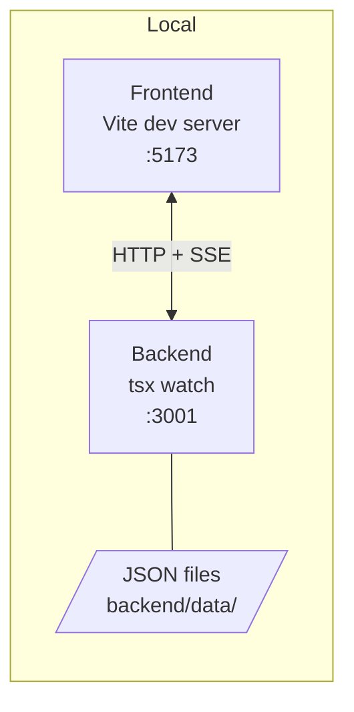

# Deployment

## Current Local Deployment



| Component | Runtime | Default |
| --- | --- | --- |
| Frontend | Vite dev server | `http://localhost:5173` |
| Backend | Express via `tsx watch` | `http://localhost:3001` |
| Runner | Mock by default | `RUNNER=mock` |
| Persistence | Local JSON files | `backend/data/*.json` created at runtime |

## Environment Variables

| Variable | Default | Purpose |
| --- | --- | --- |
| `PORT` | `3001` | Backend listen port |
| `FRONTEND_ORIGIN` | `http://localhost:5173` | CORS origin for frontend |
| `RUNNER` | `mock` | Set `cypress` for real Cypress execution |
| `MOCK_FAILURE_RATE` | `0` | Probability a mock step fails |
| `VITE_API_URL` | `http://localhost:3001` | Frontend API base URL |

## Local Commands

```bash
npm run install:all
npm run dev
npm run dev:mock
npm run dev:cypress
npm run build -w backend
npm run build -w frontend
npm run lint -w frontend
```

## Production Deployment Shape

| Layer | Recommended setup |
| --- | --- |
| Frontend | Static build served by CDN or object storage |
| API | Stateless Node service behind load balancer |
| Database | Postgres or SQLite for single-node deployment |
| Queue | Redis/BullMQ, SQS, or equivalent durable queue |
| Runner workers | Isolated containers with browser dependencies |
| Artifacts | Object storage for screenshots, videos, traces |
| Observability | Structured logs, metrics, traces, alerts |

## Production Hardening Checklist

| Area | Required before public deployment |
| --- | --- |
| Auth | User/session model, ownership, RBAC |
| Execution safety | Sandboxed workers, target allowlist, server-side codegen |
| Persistence | Durable DB, migrations, backups |
| Queue | Retry, timeout, dead-letter handling |
| API | Rate limits, pagination, error schema, OpenAPI |
| Secrets | Managed secrets, no local `.env` in images |
| Observability | Request IDs, logs, metrics, tracing |
| CI/CD | Build, lint, test, security scan |

## Deployment Tradeoff

The current local-first setup is intentionally low-friction for demo and local development. It is not a production deployment model: execution state, queues, and SSE subscribers are process-local.
