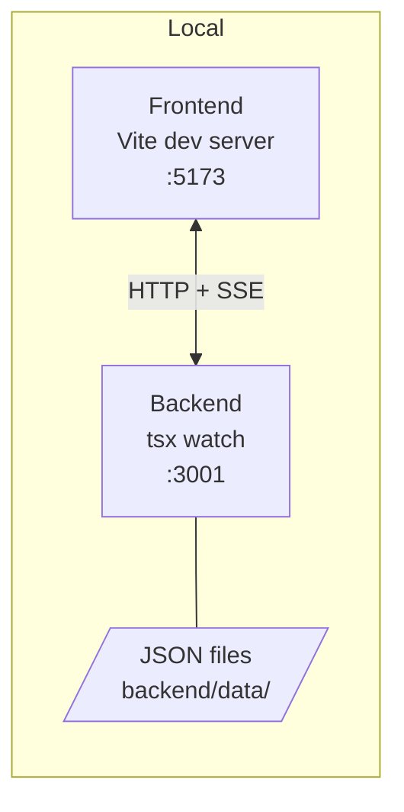

# Deployment

## Local Development



### Quick start

```bash
# 1. Install dependencies
cd backend  && npm install && cd ..
cd frontend && npm install && cd ..

# 2. Copy env files
cp backend/.env.example  backend/.env
cp frontend/.env.example frontend/.env

# 3. Start backend
cd backend && npm run dev

# 4. Start frontend (new terminal)
cd frontend && npm run dev
```

Frontend: http://localhost:5173  
Backend: http://localhost:3001

---

## Production Deployment — Render (recommended)

The repo includes `render.yaml` for one-click deployment to Render.com.

### Steps

1. Push this repo to GitHub.
2. Go to [render.com](https://render.com) → **New** → **Blueprint** → select this repo.
3. Render reads `render.yaml` and creates both services automatically.
4. Set the two manual env vars in the Render dashboard:

**vtb-backend** service:
```
FRONTEND_ORIGIN = https://vtb-frontend.onrender.com
```

**vtb-frontend** service:
```
VITE_API_URL = https://vtb-backend.onrender.com
```

5. Re-deploy both services after setting env vars.
6. Visit the frontend URL to verify.

### Manual deploy (any Node host)

**Backend:**
```bash
cd backend
npm install
npm run build        # outputs dist/index.js
NODE_ENV=production \
  PORT=3001 \
  FRONTEND_ORIGIN=https://your-frontend.com \
  RUNNER=mock \
  node dist/index.js
```

**Frontend:**
```bash
cd frontend
VITE_API_URL=https://your-backend.com npm run build
# Serve the dist/ folder with any static host
```

---

## Environment Variables

### Backend

| Variable | Default | Required in production |
|---|---|---|
| `PORT` | `3001` | Optional (host sets it) |
| `FRONTEND_ORIGIN` | `http://localhost:5173` | **Yes** — must match deployed frontend URL |
| `RUNNER` | `mock` | No — keep `mock` unless Cypress is installed |
| `MOCK_FAILURE_RATE` | `0` | No |

### Frontend (build-time)

| Variable | Default | Required in production |
|---|---|---|
| `VITE_API_URL` | `http://localhost:3001` | **Yes** — must point to deployed backend URL |

> Variables prefixed `VITE_` are baked into the static build at build time.
> Set them as build environment variables on your hosting platform, not as runtime vars.

---

## Data persistence

Backend stores flows and execution history in `backend/data/flows.json` and `backend/data/executions.json`.

- Data survives backend restarts.
- Data resets on re-deploy (no persistent volume on Render free tier).
- To seed demo data before screenshots, run the backend locally against the deployed URL or use the seed script below.

### Seeding demo data

```bash
# From project root, with backend running locally or pointed at deployed backend:
BACKEND=http://localhost:3001 node scripts/seed.js
```

(Seed script at `scripts/seed.js` — creates example flows + 5 mixed-result executions.)

---

## Current deployment constraints

- In-memory queue: concurrency=1, no retry. One execution at a time.
- SSE is process-local — works fine single-instance; would need a pub/sub layer for horizontal scale.
- Backend trusts frontend-generated `specCode` — acceptable for local/demo use.
