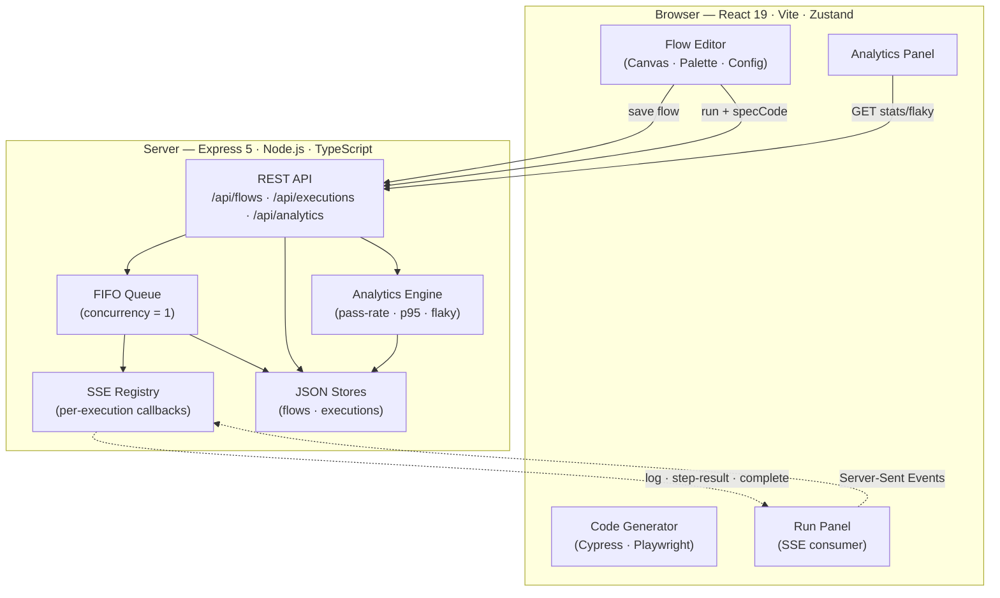

# Visual Test Builder

Full-stack E2E test authoring and execution system. Flows are modeled as versioned typed trees; the same model drives the visual editor, Zod validation, Cypress/Playwright code generation, backend execution, SSE streaming, and run analytics.


## Architecture Overview



## Why This Project

| Engineering problem | Approach |
| --- | --- |
| E2E tests are inconsistent to author | Visual suite/test/hook/step editor backed by a typed flow model |
| Framework code must stay reviewable | Deterministic Cypress and Playwright emitters from a shared IR |
| Execution needs live feedback | Express execution API with Server-Sent Events |
| Local prototypes need zero infra | JSON-backed repositories behind swappable interfaces |
| Quality signals should come from run data | History, pass-rate, duration, and flaky-step analytics |

## Engineering Highlights

| Area | What exists | Why it matters |
| --- | --- | --- |
| Domain model | Versioned `Flow` tree: suites, tests, hooks, steps, command chains, selectors, assertions, environments | Single IR powers UI, validation, codegen, persistence, execution, and analytics |
| Validation | Zod schema + command-chain registry validation | Prevents invalid root commands, incompatible chains, missing selectors |
| Code generation | Cypress and Playwright emitters | Adapter pattern isolates framework differences behind a shared model |
| Backend API | Express routes for flows, executions, SSE, analytics | Clean separation of authoring, execution, and observability |
| Async execution | FIFO in-process queue, runner interface, normalized events | Explicit job lifecycle with swappable runner engines |
| Analytics | Pass rate, avg/p95 duration, flaky-step detection | Execution history becomes engineering quality signals |

## Tech Stack

| Layer | Tech |
| --- | --- |
| Frontend | React 19, Vite 8, Zustand, dnd-kit, Zod |
| Backend | Node.js, Express 5, TypeScript, Zod, uuid |
| Execution | Mock runner (default) · Cypress runner (`RUNNER=cypress`) |
| Persistence | In-memory maps hydrated/flushed to local JSON files |
| Streaming | Server-Sent Events (backend → browser) |
| Tooling | npm workspaces, tsx, tsup, ESLint |

## Feature Matrix

| Feature | Status | Notes |
| --- | --- | --- |
| Visual suite/test/hook builder | Implemented | Tree model, nested suites, lifecycle hooks |
| Command palette and config panel | Implemented | Query, action, assertion, utility commands |
| Cypress code generation | Implemented | Used by copy/export and Cypress runner |
| Playwright code generation | Implemented | Export/preview path |
| Flow import/export | Implemented | JSON import supports v1→v2 migration |
| Saved flows API | Implemented | Full CRUD: create/list/get/update/delete |
| Live execution updates | Implemented | SSE stream for logs, status, step results |
| Execution history | Implemented | Backend-persisted run summaries |
| Flaky-step analytics | Implemented | Sliding-window heuristic over recent history |
| Authentication | Not implemented | Documented extension point |
| Cache layer | Not implemented | Current state is in-process + local JSON |

## Repository Layout

```
.
├── README.md
├── ARCHITECTURE.md
├── DECISIONS.md
├── TECH_DEBT.md
├── DEPLOYMENT.md
├── CONTRIBUTING.md
├── docs/
│   └── diagrams/          # Excalidraw sources
├── frontend/
│   └── src/
│       ├── core/          # model · registry · codegen · validation · state
│       ├── features/      # UI panels
│       ├── hooks/         # custom React hooks
│       └── services/      # HTTP clients
└── backend/
    └── src/
        ├── routes/        # Express route handlers
        ├── db/            # FlowStore · ExecutionStore
        ├── queue/         # FIFO queue · SSE registry
        ├── runner/        # IRunner · MockRunner · CypressRunner
        └── analytics/     # pass-rate · p95 · flaky detection
```

## Quick Start

**Requirements:** Node.js 18+

```bash
npm run install:all
npm run dev
```

| Service | URL |
| --- | --- |
| Frontend | `http://localhost:5173` |
| Backend health | `http://localhost:3001/health` |

**Run modes:**

```bash
npm run dev:mock     # simulated execution (default)
npm run dev:cypress  # real Cypress execution (requires Cypress in backend/)
```

## System Overview

| Flow | Summary |
| --- | --- |
| Build | User edits a flow tree in React; Zustand stores current flow + undo/redo history |
| Validate | Zod checks shape; command registry checks args and chaining compatibility |
| Generate | `generate(flow)` dispatches to Cypress or Playwright emitter |
| Save | Frontend POSTs flow JSON to `/api/flows`; persisted through `FlowStore` |
| Run | Frontend POSTs flow + generated `specCode` to `/api/executions` |
| Stream | Backend queue consumes runner events and broadcasts SSE updates |
| Analyze | Analytics scans execution history for stats and flaky-step candidates |

## API Overview

| Endpoint | Purpose |
| --- | --- |
| `GET /health` | Service health check |
| `POST /api/flows` | Save a flow snapshot |
| `GET /api/flows` | List saved flow summaries |
| `GET /api/flows/:id` | Load one saved flow |
| `PUT /api/flows/:id` | Update saved flow |
| `DELETE /api/flows/:id` | Delete saved flow |
| `POST /api/executions` | Queue execution |
| `GET /api/executions` | List execution summaries |
| `GET /api/executions/:id` | Load full execution record |
| `DELETE /api/executions/:id` | Cancel queued or running execution |
| `GET /api/executions/:id/events` | SSE stream for live run updates |
| `GET /api/analytics/stats` | Aggregate execution stats |
| `GET /api/analytics/flaky` | Flaky-step candidates |

## Production Readiness

| Concern | Current | Production direction |
| --- | --- | --- |
| Persistence | Local JSON files | SQLite/Postgres with migrations and indexes |
| Queue | In-process FIFO, concurrency 1 | Durable queue + isolated worker pool |
| Auth | None | OIDC/session auth, RBAC, audit logs |
| Execution safety | Backend trusts frontend `specCode` | Sandboxed workers, server-side codegen, allowlisted targets |
| Observability | UI logs + history | Structured logs, metrics, traces, artifacts |
| Tests | Not present | Unit, integration, codegen snapshots, queue tests |

## Documentation

| Document | Purpose |
| --- | --- |
| [ARCHITECTURE.md](ARCHITECTURE.md) | Module map, request/data/async/cache/scaling flows |
| [DECISIONS.md](DECISIONS.md) | Architectural decisions, tradeoffs, deferred choices |
| [TECH_DEBT.md](TECH_DEBT.md) | Bottlenecks, coupling, missing production practices |
| [DEPLOYMENT.md](DEPLOYMENT.md) | Local and production deployment model |
| [CONTRIBUTING.md](CONTRIBUTING.md) | Architecture rules, adding commands, verification |
| [docs/diagrams](docs/diagrams) | Excalidraw diagram sources |

## Future Improvements

| Priority | Improvement |
| --- | --- |
| P0 | Add tests for validation, codegen, migration, queue, stores, analytics |
| P0 | Share flow schema/types between frontend and backend as a workspace package |
| P1 | Durable persistence (SQLite/Postgres) and queue workers |
| P1 | Auth, RBAC, and execution sandbox |
| P2 | Playwright runner |
| P2 | Run artifacts: screenshots, traces, and retention policies |
